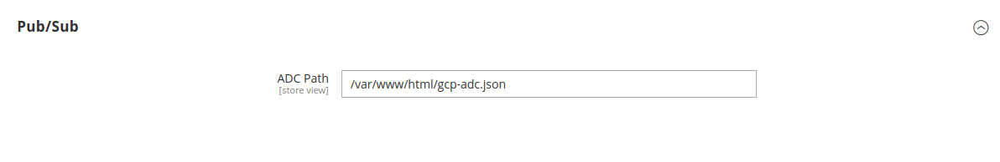

# MageOS Async Events GCP

GCP event sinks for [mageos-async-events](https://github.com/mage-os/mageos-async-events)

## Installation

```sh
composer require mage-os/mageos-async-events-gcp
```

## Authenticating with Google Cloud Client Libraries

This module relies on Google's PHP Cloud Client Libraries. Each event sink uses a corresponding library to perform
requests to Google Cloud.

For more information about the client libraries, please see https://cloud.google.com/php/docs/reference

As per the [Authentication Guide](https://github.com/googleapis/google-cloud-php/blob/main/AUTHENTICATION.md), the
recommended way to authenticate to the Google Cloud PHP library is to use Application Default Credentials (ADC),
which discovers your credentials automatically, based on the environment where your code is running.

Application Default Credentials (ADC) typically come in the form of a credential JSON file. This file can include
credentials for workload identity federation, workforce identity federation, or a service account key.

There are many ways to obtain an ADC, so you must review and choose a method that fits your use case.

> [!IMPORTANT]
> Service account keys can pose a security risk if not managed correctly. Whenever possible, opt for a more secure
> alternative to service account keys.

To authenticate using different methods, refer to the following guides:

- **Service Account Key:** [Service account key authentication](https://cloud.google.com/docs/authentication/provide-credentials-adc#wlif-key)
- **Workload Identity Federation:** [Workload Identity Federation authentication](https://cloud.google.com/docs/authentication/provide-credentials-adc#wlif)
- **Google Cloud Services:** If your code is running on a supported Google Cloud service such as Compute Engine, you can authenticate by attaching a service account. Read more about [Google Cloud services that support attaching a service account](https://cloud.google.com/docs/authentication/provide-credentials-adc#attached-sa)
- **GKE or GKE Enterprise:** [Containerized authentication](https://cloud.google.com/docs/authentication/provide-credentials-adc#containerized)

## GCP event sinks

### Google Pub/Sub

**Setup Application Default Credentials (ADC)**

A Service Account with the `Pub/Sub Publisher` role is required so that the notifier can relay events into Google
Pub/Sub.

Under `Stores -> Services -> Async Events GCP` set the `ADC Path`.



**Create a Pub/Sub Subscription**

The following is an example to create a Pub/Sub subscription for the `example.event`

```sh
curl --location --request POST 'https://test.mageos.dev/rest/V1/async_event' \
--header 'Authorization: Bearer TOKEN' \
--header 'Content-Type: application/json' \
--data-raw '{
    "asyncEvent": {
        "event_name": "example.event",
        "recipient_url": "Google Pub/Sub Topic",
        "verification_token": "supersecret",
        "metadata": "pubsub"
    }
}'
```
